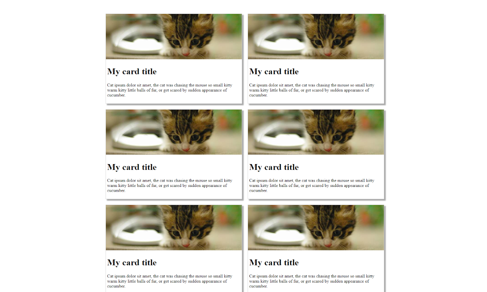
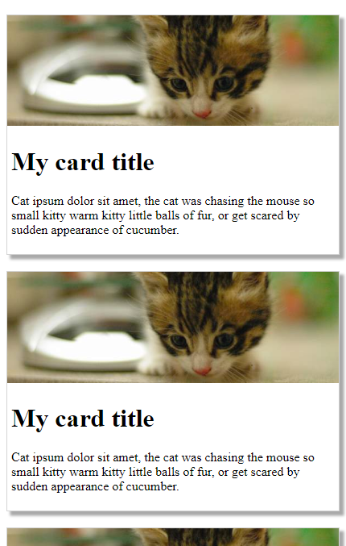
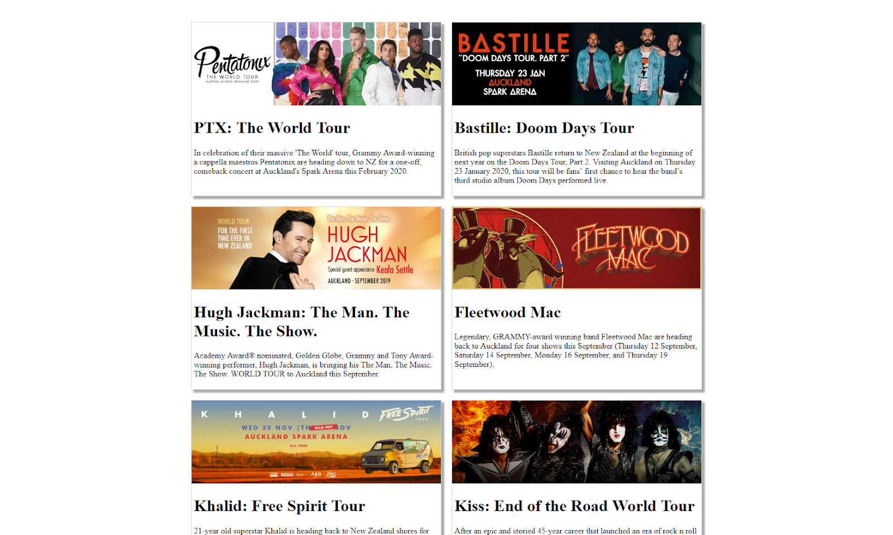
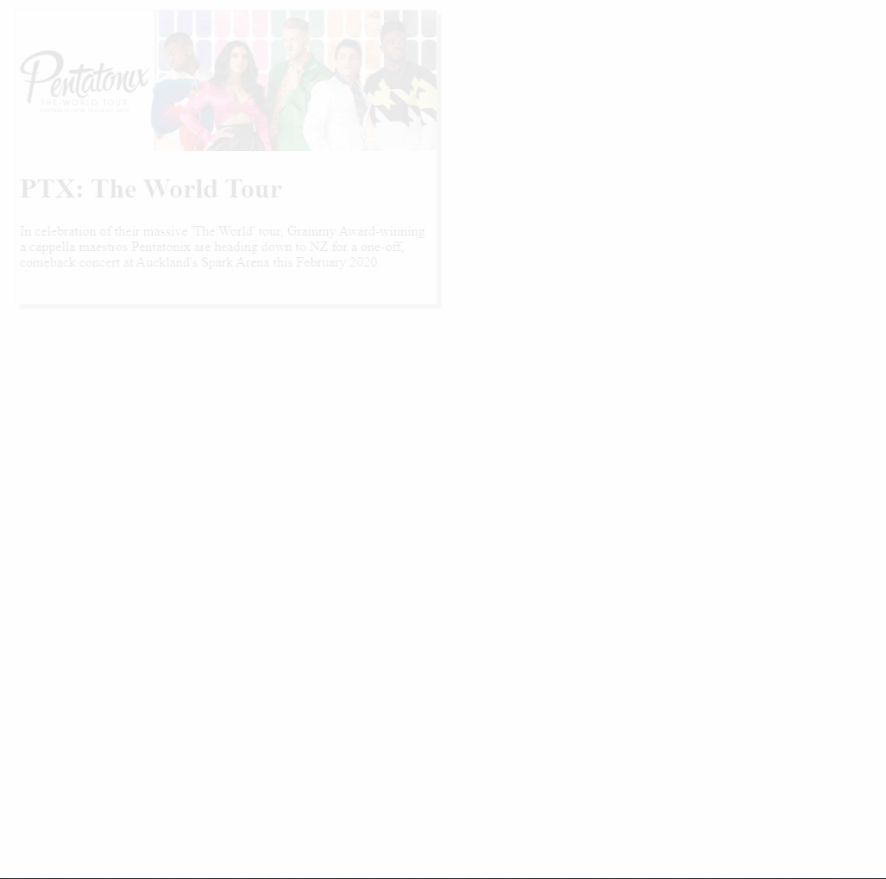

# COMPSCI 719 Practical Test One &ndash; CSS and Basic JavaScript
In this test, you will put in practice the knowledge you've gained in modules 1 through 5 of the course

- There are **three** questions in this practical test. Please attempt all questions. Each question is worth **20** marks, for a total of **60** marks. These marks constitute **10%** of your overall grade for COMPSCI 719.

- This is an open book test. You may use any bound printed or handwritten notes during the test. You may also use any online or PC-based resources available to you. However: **Do not** post the questions online or otherwise attempt to allow others to provide you with the answers - including your classmates and tutors! If you do this, you will be caught, you will receive 0 marks for this assessment, and you may be subject to disciplinary action.

- **Important:** Make sure to read all instructions carefully before attempting each question.


## Submission instructions
Your latest commits to the `main` and `question-3-part-2` branches of your GitHub Classroom repository for this assignment, as of the due date identified on Canvas, will serve as your submission for this assignment.


## Question One &ndash; Charizard's roar (20 marks)
For this question, using a combination of CSS positioning, transforms, transitions, filters and other miscellaneous CSS attributes, we’ll build a webpage looking like this:


When the user hovers over the fire breath, it will expand as shown here:


Open [`question1.html`](./question-01/question1.html) and look through the initial implementation that has been provided. View the HTML file in a web browser to see the current functionality it provides. Within the page body, there’s a single `<div id = "container">`, itself containing four child `` elements. You'll also notice a link to [`question1.css`](./question-01/question1.css), which contains six currently-empty CSS selectors which you'll complete for this question. **Note:** You may not modify the HTML file for this question.

To change this implementation to the intended end result described above, complete the following by adding appropriate CSS rules to `question1.css`:

<!-- 1. The `#background` image should be sized to 800 x 600 px *(1 mark)*. -->

2. The `#container` div should be the same size as the background image, and be centered vertically and horizontally in the browser. It should have a 1px solid black border *(4 marks)*.

<!-- 3. The `#charizard` image should have a height of 500px, and should be positioned 210px from the left, and 90px from the top, of the div’s edges. It should appear above the #background image *(3 marks)*. -->

<!-- 4. The `#tail` image should be 100px wide, and should be positioned 315px from the top, and 634px from the left, of the div’s edges. It should appear above the #charizard image *(2 marks)*. -->

<!-- 5. The `#breath` image should be 100px wide, and be positioned 100px from the top, and 360px from the left, of the div’s edges. It should be rotated by 45 degrees and should appear above the #charizard image *(4 marks)*. -->

<!-- 6. The origin point of the rotation above should not be the centre of the image, but rather, set to 90% of the image's width, and 50% of the image’s height *(1 mark)*. This can be done by setting the transform-origin property as follows: `transform-origin: 90% 50%;` -->

<!-- 7. When the user hovers over the `#breath` image, it should be scaled to 300% of its original size. The transition between different sizes should take one second to complete *(3 marks)*. -->

<!-- 8. To achieve the subtle glowing effect of the #charizard image as shown in the screenshots above, investigate the CSS drop-shadow() function which can be applied as a filter *(2 marks)*. To get the marks for part 8, you don’t need to get the glow effect exactly the same - just reasonably close! -->


<!-- ## Question Two &ndash; Cats (20 marks)
In this question, we will appropriately style a webpage in a grid-style layout. Examining [`question2.html`](./question-02-03/question2.html), you'’'ll notice that the page has several HTML elements containing dummy data, organized into card `<div>`s. For the first part of this question, we will modify only [`question2.css`](./question-02-03/question2.css) to style the webpage so it looks like the following screenshot:



### Part 1: Styling (16 marks)
To begin, apply styles to question2.css such that the website looks as per the above screenshot. Specifically, apply the following styles: -->

<!-- 1. The `#container` div should have a top margin of 50px, and auto left and right margins. It should be 1000px wide *(2 marks)*. -->

<!-- 2. The `#container` div should lay out its child components using CSS grid. The grid should have two equally-sized columns, and auto rows. There should be a gap of 20px in between each grid item, both vertically and horizontally *(4 marks)*. -->

<!-- 3. The `.card` divs should have a 1px solid light gray border. In addition, they should have a dark gray box-shadow of 5px horizontally, 5px vertically, with a 3px blur. **Hint:** Investigate the CSS `box-shadow` property for this *(3 marks)*. -->

<!-- 4. The `.card` divs should lay out their child components using flexbox. The flex direction should be column, and the content should be justified at the start *(3 marks)*. -->

<!-- 5. The `.card-image` images should have a width of 100%, and should have the following property set so that they maintain their aspect ratio when resized: `object-fit: cover;` *(2 marks)*. -->

<!-- 6. The `.card-body` divs should have a 5px margin on the bottom, left, and right *(2 marks)*. -->

<!-- ### Part 2: Responsive design (4 marks)
Further style your design such that it is responsive. Specifically, apply the following styles:

1. When viewing your webpage on a screen of size 1000px or less, the width of the `#container` div should be changed to 100%, and its left and right margins should be removed *(2 marks)*. -->

<!-- 2. When viewing your webpage on a screen of size 800px or less, the `#container` div's grid should additionally be changed to have only one column *(2 marks)*. -->

<!-- 


## Question Three &ndash; Concerts (20 marks)
**Note: If you’re stuck with Question Two, you can still get the marks for Question Three even if Question Two isn’t complete.**

For this question, we'll remove the dummy cat data in Question Two, and replace it with information about concerts, loaded from JavaScript. The end result of your web app will look like the following screenshot:



### Part 1: JSON and creating HTML elements (15 marks)
Begin by **commenting out (DO NOT DELETE)** all the HTML elements *inside* the `#container div` (but **not** the container itself). Then, examine the files [`question3-concerts.js`](./question-02-03/question3-concerts.js) and `question3.js`(./question-02-03/question3.js). `question3-concerts.js` contains an array of JSON concert objects which are to be displayed as cards in your webpage. `question3.js` contains a starting point in which you will complete the implementation. Complete the JavaScript implementation by performing the following steps: -->

<!-- 1. Add the necessary tags to `question2.html`'s `<head>`, to load the two JavaScript files. `question3-concerts.js` should be loaded first *(2 marks)*. -->

<!-- 2. At the marked location within `question3.js`, create a function called `addCard()`. This function should:

   - Accept a single argument, which will be the info about a single concert. Name the argument appropriately *(3 marks)*. -->

   <!-- - Get a reference to the `#container` div *(2 marks)*.

   - Add the HTML elements given in the comments to the `#container` div. The contents of the HTML elements should be obtained from the concert object that's given as an argument *(4 marks)*. -->

<!-- 3. At the marked location within `question3.js`, loop through each element in the `concerts` array. For each concert in the array, the `addCard()` function should be called, supplying that concert as a parameter. **Hint:** Any looping method will work (and receive full marks), but the `forEach()` function is recommended *(4 marks)*.

#### Hints
- Even though the `concerts` array is declared in a different file, you should still be able to access it from `question3.js` as long as you import both script files properly in step 1 above.

- Remember that you can look at `question3-concerts.js` to see the JSON structure for a single concert object.

- When using template literal strings, the strings are allowed to span multiple lines. For example, the following code is perfectly legal in JavaScript:

```js
const myLiteral = `
    <ol>
        <li>Andrew gives good hints in tests</li>
    </ol>`;
```

This tip might help you to make your template literals (should you choose to use them) more readable / manageable. -->

### Part 2: Extension (5 marks)
For the final part of this question, we'll be making our concerts page a little more interesting by animating the cards as they appear on-screen.

Before starting this part, **make sure you've committed and pushed all your code so far to the `main` branch of your GitHub Classroom repository**. Then, create a *new* branch for this part, called `question-3-part-2`. Commit and push your solution to this part to that branch, instead of `main`. We're doing this just in-case we break something from questions Two and Three so far - we wouldn't want to accidentally delete our working code!

1. Using any combination of CSS and JavaScript you like, modify the webpage so that each concert's card starts out fully transparent, and animates to fully opaque over about 0.5 seconds when the page loads. Concerts should remain fully opaque once they reach this point *(2 marks)*.

2. Further modify the page so that there is a delay of about 0.2 seconds between each concert appearing. See the animation below (or check out [`spec/question-03-animation.gif`](./spec/question-03-animation.gif)) for an example of what this looks like *(3 marks)*.


